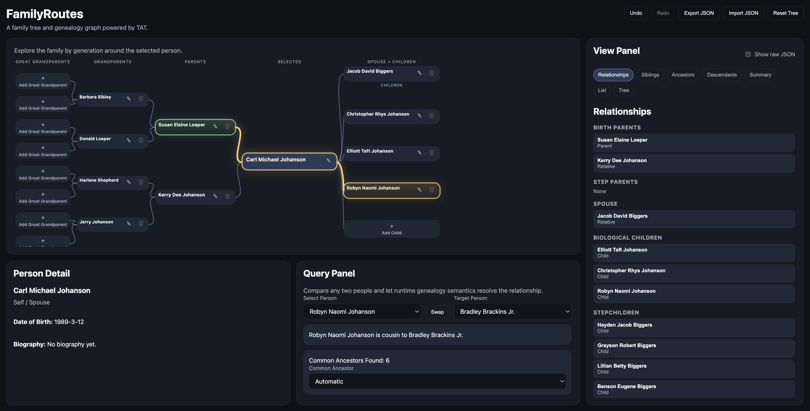
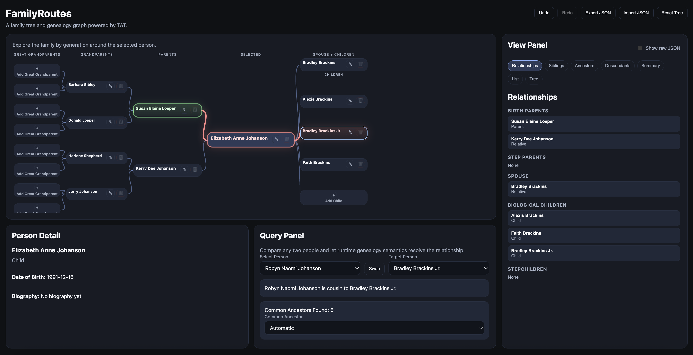
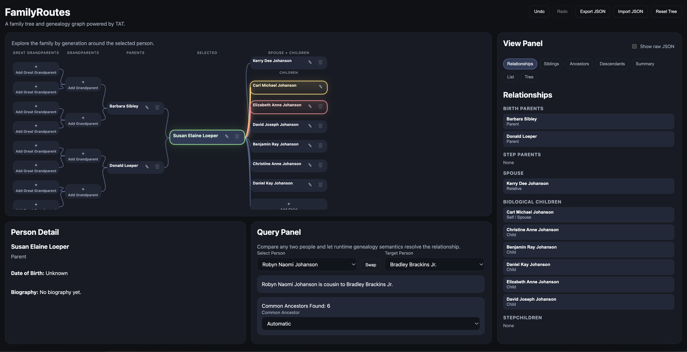

# 🧬 FamilyRoutes (Powered by TryAngleTree)

🔗 Live App: https://family-routes.vercel.app/
📦 GitHub: https://github.com/cjohanson64-netizen/FamilyRoutes

## Overview

This project is an interactive genealogy application built on top of **TryAngleTree (TAT)** — a semantic graph language and runtime designed to model relationships as first-class, structured data.

Instead of hardcoding family logic in UI or JavaScript conditionals, this app uses:

* **TAT for structure + semantics**
* **JavaScript for execution + rendering**
* **React for UI**

This separation allows the system to remain:

* deterministic
* explainable
* extensible

---

## ✨ What Makes This Different

Unlike traditional genealogy apps that rely on static tree structures and UI-driven logic, FamilyRoutes:

- models relationships as a graph
- computes connections dynamically
- explains *why* two people are related

This enables features like:
- path-based relationship visualization
- common ancestor selection
- deterministic relationship computation

---

## 📸 Preview

### Relationship Comparison Flow

1. Select a person  


2. Choose a target  


3. Override the common ancestor  


4. Visualize the relationship path  

---

## 🧠 Core Idea

> The UI does not *decide* relationships.
> The graph *defines* them.

Everything in this app — parents, spouses, siblings, cousins, in-laws — is derived from a **graph of nodes and edges**, not from UI assumptions.

---

## 🎯 Why This Matters

Most applications embed logic directly in UI components, making them fragile and hard to reason about.

FamilyRoutes demonstrates a different approach:

- Move logic into a structured graph layer
- Let the UI simply render results
- Make relationships deterministic and explainable

This pattern applies beyond genealogy — to any system where relationships and rules must remain consistent and traceable.

---

## 🧱 Architecture

### 1. TAT (TryAngleTree)

TAT defines:

* Nodes → people
* Edges → relationships
* Actions → mutations (add parent, add spouse, etc.)
* Derives → queries (siblings, ancestors, etc.)
* Projections → UI-ready data (tree, list, comparison)

Pipeline:

```
@seed → @graft → @derive → @project
```

---

### 2. Runtime (JavaScript / TypeScript)

The TAT runtime:

* parses `.tat` files
* executes graph mutations
* evaluates derives
* returns structured results to the UI

The runtime is the **source of truth**.

---

### 3. React UI

React components:

* render projections
* trigger actions
* display results

React **does not compute relationships**.

---

## 🔗 Data Model

### Nodes

Each person is a node:

```js
{
  id: "person_123",
  type: "person",
  fullName: "Carl Johanson",
  dateOfBirth: "1989-03-12",
  ...
}
```

---

### Edges

Relationships are edges.

#### Parent

```
A ── parentOf(kind: "birth") ──> B
A ── parentOf(kind: "step") ──> B
```

#### Spouse

```
A ── spouseOf(active: true) ── B
```

---

### Why this matters

Instead of:

* `birthParent`
* `stepParent`

We use:

* `parentOf` + metadata

This keeps structure stable and meaning flexible.

---

## 🧬 Relationship Logic

All relationships are derived from the graph.

### Examples

#### Biological siblings

Two people are siblings if:

```
share parentOf(kind="birth") parent
```

#### Step-parent

```
A is step-parent of B if:
A ── parentOf(kind="step") → B
```

#### Cousins

Derived via:

```
ancestor → branching paths → descendant
```

#### In-laws

Derived via:

```
parent → spouse → target
```

---

## 🔍 Comparison Engine

The app can answer:

```
"How is A related to B?"
```

The runtime returns:

* relationship label
* path nodes
* path edges
* common ancestors

---

## 🎯 Path Highlighting

Paths are visualized in the UI:

* 🟡 Yellow → selected person path
* 🟢 Green → common ancestor
* 🔴 Red → target person path

Each node and edge resolves to **one final state** (no overlap).

---

## 🧩 Common Ancestor Override

Users can:

* select a specific common ancestor
* override automatic relationship resolution
* explore alternative lineage paths

---

## ✍️ Editing Model

All edits are **graph mutations**.

Examples:

* Add Parent
* Add Spouse
* Assign Birth Parent
* Assign Step Parent

Each relationship is assigned **per child**, not globally.

---

## ⚠️ Key Design Principle

> The UI is a view.
> The graph is the truth.

This avoids:

* fragile UI logic
* hidden assumptions
* inconsistent family structures

---

## 🚀 Why TAT?

Traditional apps:

* embed logic in components
* rely on conditionals
* become brittle

TAT approach:

* explicit structure
* declarative relationships
* deterministic queries

---

## 🧠 TAT Philosophy

> Nodes are nouns.
> Edges are verbs.
> Meaning lives in relationships.

---

## 📦 Features

* Dynamic family tree
* Relationship comparison engine
* Step / birth parent modeling
* In-law detection
* Path highlighting
* Common ancestor override
* Fully graph-driven UI

---

## 🛠 Tech Stack

* React
* Vite
* JavaScript / TypeScript
* TryAngleTree (custom DSL + runtime)

---

## 🛠 Run Locally

```bash
git clone https://github.com/cjohanson64-netizen/FamilyRoutes
cd family-routes
npm install
npm run dev
```

---

## 📌 Future Ideas

* marriage timelines (start/end)
* adoption modeling
* graph persistence / sync
* collaboration
* search + disambiguation

---

## 🧑‍💻 Author

Built by Carl Johanson

---

## 💡 Final Thought

This app is not just a family tree — it's a relationship engine.

It is a demonstration that:

> **structure-first systems can replace logic-heavy UI design.**

And that relationships — when modeled explicitly — become far easier to reason about, extend, and trust.
